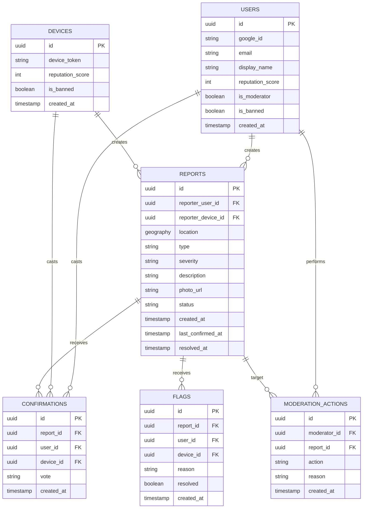

# T3adi? — Project Plan

An open-source, community-driven map for reporting dangerous road conditions
(flooding, potholes, blockages, and accidents/obstacles) in Tunisia,
with time-decayed report freshness and simple community verification.

This document is the output of a planning session covering product scope,
tech stack, architecture, database design, algorithms, API, frontend, repo
structure, and roadmap. It's meant to live in the repo as living
documentation (`docs/PROJECT_PLAN.md`) and evolve as the project does.

---

## Phase 1 — Understanding & Challenging the Idea

**The concept**: A Waze-style community reporting map, scoped specifically to
road _condition/safety_ hazards rather than traffic. Users report hazards on
a map; other users confirm or dispute them; reports decay in confidence over
time so stale reports don't mislead drivers.

### Key risks and challenges identified

1. **Cold-start problem** — a crowdsourced map is worthless with zero
   reports. Recommendation: launch in one city/region first, not the whole
   country, to build report density before expanding.
2. **Reporting while driving is dangerous** — the report flow must be fast
   (one-tap first, details after), and the app should encourage reporting
   only when stopped/as a passenger.
3. **Liability/duty-of-care** — the app must never imply "official" or
   verified accuracy. Clear disclaimers are required throughout the UI.
   (Not legal advice — a local lawyer should review anything relied upon
   commercially.)
4. **Trust is a statistical problem, not a data problem** — with no
   official data feed, confidence can only come from aggregating
   independent confirmations, and the UI must communicate confidence
   honestly (not just a color).
5. **Stale reports are worse than no reports** — freshness/decay must be a
   first-class UI element, not a footnote.
6. **Location precision vs. privacy/noise** — raw GPS pins are noisy;
   reports are point-based with a "nearby" radius query for MVP rather than
   full road-segment map-matching (deferred to v2).
7. **Duplicate reports during real incidents** — near-duplicate reports of
   the same hazard must be merged server-side (proximity + time window),
   not shown as separate pins.
8. **Photos are a significant abuse/privacy/moderation surface** — deferred
   out of MVP entirely.
9. **Fake reports / vandalism** — mitigated via rate limiting + lightweight
   reputation, not eliminated (accepted risk for MVP).
10. **Anonymity vs. accountability tension** — resolved by supporting both:
    anonymous device-based reporting by default, optional accounts for
    reputation.
11. **Routing is a much bigger feature than it looks** — full turn-by-turn
    routing is explicitly out of scope; a simpler "does my route cross a
    hazard" check is a v2+ idea at most.
12. **Legal/regulatory** — worth a local sanity check on any Tunisia-specific
    rules about geodata publication (not something researched here).

### Things to keep in mind going forward

- Offline support (bad weather often means bad connectivity) — v2.
- Multi-language UI (French/Arabic) — planned from day one at the string
  level, even if only one language ships first.
- Moderation labor — an open-source volunteer project needs a plan for who
  moderates, even a minimal one.
- Base map data licensing (OpenStreetMap/ODbL) and this project's own data
  license should be decided early.

---

## Phase 2 — MVP Specification

### Must have

- Interactive map (pan/zoom, colored status markers)
- View reports on the map
- Create a report (location + type + severity, minimal fields)
- Location selection (tap map or "use my location")
- Problem type selection (flooding, pothole, blocked, accident/obstacle, other)
- Severity selection (caution / dangerous / blocked)
- Optional short text description
- Report freshness/decay shown in the UI
- Confirm / dispute a report
- Anonymous reporting (no account required)
- Optional lightweight accounts (Google OAuth) for reputation
- Basic rate limiting
- Basic spam/abuse protection (heuristics, no ML)
- Report expiration (auto-downgrade over time)
- Mobile-responsive UI

### Should have (soon after MVP)

- Filter by type / severity / recency
- Location search (geocoding)
- Report detail panel (confirmation count, timeline)
- French/Arabic language toggle
- Simple reputation score affecting vote weight
- Photo upload (needs a moderation pipeline first)

### Could have (v2+)

- Notifications for saved areas
- "Does my route cross a hazard" check (not full routing)
- Public API for third parties (news, NGOs, authorities)
- PWA/offline support
- Admin analytics dashboard
- Data export (CSV/GeoJSON)

### Not for MVP

- Turn-by-turn routing/navigation
- Native mobile apps
- ML-based hazard prediction
- Full social features (comments, following, DMs)
- Multi-country expansion
- Real-time chat

---

## Phase 3 — Technology Stack

Chosen based on: TypeScript-only team, Docker-comfortable, monorepo,
web-only for now, free-to-start with room to grow, Tunisia-based single
region launch.

```
Frontend:   React + TypeScript + Vite + Leaflet + Tailwind CSS
Backend:    Node.js + Express + TypeScript + Zod (validation)
Database:   PostgreSQL + PostGIS
Auth:       Google OAuth (optional accounts) + anonymous device reporting
Tiles:      MapTiler or Stadia Maps free tier (OSM-based; do NOT use raw
            tile.openstreetmap.org in production — usage-policy violation)
Storage:    (deferred) Cloudflare R2 when photos are added
Hosting:    Vercel (frontend) + Fly.io or Railway (backend + DB)
Repo:       Monorepo (npm workspaces), Docker Compose for local dev
API style:  REST + OpenAPI docs
```

### Why these choices (trade-offs considered)

- **Leaflet over MapLibre GL**: simpler API, better documentation for
  beginner contributors, sufficient for MVP. MapLibre (vector tiles) is a
  clean upgrade path later without backend changes.
- **PostgreSQL + PostGIS over MongoDB**: geospatial "nearby" queries are
  core to this app; PostGIS is the mature, free, open-source standard for
  this. Not close.
- **Google OAuth only (optional) over custom email/password**: avoids
  owning password security; matches the "anonymous by default" decision.
  Email/password can be added later if there's real demand.
- **REST over GraphQL**: the data shape is simple CRUD + geo queries;
  GraphQL adds a learning-curve cost with no real benefit here.
- **No Redis/caching for MVP**: Postgres with a spatial index comfortably
  handles low-thousands of users; premature caching is unnecessary
  complexity.

---

## Phase 4 — Architecture

### High-level architecture

- **Frontend** (React + Vite, hosted on Vercel) talks directly to the map
  tile provider for tiles, and to the backend API for all report data.
- **Backend API** (Express + TypeScript, hosted on Fly.io/Railway) owns all
  business logic, the database, and Google OAuth verification.
- **Database** (PostgreSQL + PostGIS) stores all persistent data.
- **Map tiles** and **Google OAuth** are external third-party services the
  app depends on but doesn't run.

### Frontend structure

```
src/pages/        top-level routes (Map, ReportDetail, Login, About)
src/components/   MapView, ReportMarker, ReportForm, FilterPanel, etc.
src/hooks/        useNearbyReports, useCreateReport, useUserLocation
src/api/          typed API client (shared types with backend)
src/i18n/         externalized strings (French/Arabic-ready)
```

State management: React Query (TanStack Query) for server state, plain
React state for UI state. No Redux needed at this scale.

### Backend structure

```
src/routes/       one file per resource (reports.ts, confirmations.ts, ...)
src/services/     business logic separated from HTTP handling
src/db/           query functions and migrations
src/middleware/   rate limiting, auth check, error handling
src/validation/   Zod schemas
```

Query layer: Drizzle or Prisma (both TypeScript-first; Drizzle has more
natural raw-SQL escape hatches for the PostGIS queries this app needs
often — worth a quick hands-on comparison before committing).

### Authentication flow

Anonymous reporting requires no token beyond a per-device random ID stored
client-side (`localStorage`) and sent as a header — enough for rate
limiting and "my reports" without identifying anyone. Google OAuth layers
on top only for people who want a persistent identity/reputation, via a
standard OAuth2 code flow issuing a short-lived JWT session cookie.

### Security baseline

- HTTPS everywhere (free via chosen hosts)
- Per-IP and per-device rate limiting on writes
- Zod validation on every endpoint
- ORM/parameterized queries only, no raw SQL string concatenation
- CORS locked to the frontend domain
- Helmet.js for standard HTTP security headers
- Secrets via environment variables only, `.env.example` documented,
  real `.env` gitignored

---

## Phase 5 — Database Design

MVP uses **point-based reports** (lat/lng), not precise OSM road-segment
matching — that's a significant technical project deferred to v2.



### Notes on key fields

- `reports.location`: PostGIS `geography(Point, 4326)` with a GiST spatial
  index — enables fast "nearby" queries at any realistic scale.
- `reports.status`: `active | resolved | expired | hidden`. `hidden` is a
  moderator removal (kept for audit, never shown publicly). `expired` is
  set by the freshness algorithm automatically — reports are never
  deleted outright, which preserves history for later analytics.
- `confirmations.vote`: `confirm | dispute | resolved`, unique per
  `(report_id, coalesce(user_id, device_id))` — one active vote per
  identity, update rather than duplicate.
- `devices.device_token`: a random UUID generated client-side, never tied
  to anything identifying.
- Every report/confirmation/flag has exactly one of `user_id` or
  `device_id` set — this is how "anonymous by default, optional accounts"
  is implemented at the data layer.

---

## Phase 6 — Road-Condition Algorithm (transparent, rules-based)

### 1. Type-specific expiry windows

| Type                    | "Fresh" window | Fully expires after |
| ----------------------- | -------------- | ------------------- |
| Flooding                | 2 hours        | 8 hours             |
| Blocked road / accident | 1 hour         | 6 hours             |
| Pothole / damaged road  | 14 days        | 90 days             |
| Other                   | 6 hours        | 24 hours            |

The clock is `last_confirmed_at` (or `created_at` if never confirmed) —
each new confirmation resets it, which is what keeps a genuinely ongoing
hazard "hot."

### 2. Confidence score (0–100), computed on read

```
confidence = severity_weight
           × recency_factor(type, time_since_last_confirmed)
           × trust_factor(net_weighted_votes)
```

- `recency_factor` = 1.0 within the fresh window, linearly decays to 0 by
  the full-expiry time.
- `net_weighted_votes` = confirm weights minus dispute weights, where each
  voter's weight is ~1.0 for a device, up to 2.0 for a reputable account,
  and ~0.2 for a flagged/low-trust identity.
- A "resolved" vote from the original reporter, or 2+ "resolved" votes
  from anyone else, immediately sets `status = resolved`.

### 3. Displayed status

| Confidence & votes                                            | Displayed status             |
| ------------------------------------------------------------- | ---------------------------- |
| Resolved vote(s) received                                     | 🟢 Cleared                   |
| confidence ≥ 60 and severity = blocked                        | ⚫ Blocked/impassable        |
| confidence ≥ 40 and severity = dangerous, or blocked below 60 | 🔴 Dangerous                 |
| confidence 15–40, or decaying dangerous/blocked               | 🟡 Caution                   |
| confidence < 15 (past expiry)                                 | _(no marker — auto-expired)_ |

### 4. Always show the "why"

Every report detail view shows plain language, e.g. _"Reported 12 minutes
ago · 3 confirmations · last confirmed 4 minutes ago"_ — the color is a
summary, the text is the truth.

### 5. Duplicate merging

A new report of the same type within ~75m and ~30 minutes of an existing
active report is treated as a confirmation of the existing report
(`ST_DWithin` proximity check), not a new pin.

---

## Phase 7 — API Design

| Method & Path                             | Auth           | Purpose                                    |
| ----------------------------------------- | -------------- | ------------------------------------------ |
| `POST /api/reports`                       | device         | Create a report                            |
| `GET /api/reports`                        | none           | List reports near a location, with filters |
| `GET /api/reports/:id`                    | none           | Full detail incl. confirmation history     |
| `POST /api/reports/:id/confirmations`     | device or user | Cast/update a vote                         |
| `POST /api/reports/:id/flags`             | device or user | Flag a report                              |
| `GET /api/auth/google`                    | none           | Start Google OAuth                         |
| `GET /api/auth/google/callback`           | none           | OAuth callback, sets session               |
| `GET /api/auth/me`                        | user           | Current user info                          |
| `POST /api/auth/logout`                   | user           | Clear session                              |
| `GET /api/moderation/flags`               | moderator      | List open flags                            |
| `POST /api/moderation/reports/:id/hide`   | moderator      | Hide a report                              |
| `POST /api/moderation/reports/:id/unhide` | moderator      | Unhide a report                            |
| `POST /api/moderation/users/:id/ban`      | moderator      | Ban a user/device                          |

Photo upload endpoints are deferred (see Phase 1/2).

---

## Phase 8 — Frontend Screens

- **Map page** — full-screen map, floating "Report" button, colored/iconed
  markers, persistent unobtrusive disclaimer link.
- **Report creation** — bottom sheet: place pin or use location → type
  grid → severity → optional description → submit. Target: completable in
  under 15 seconds, one-handed.
- **Report detail** — bottom sheet: status, confidence explanation,
  Confirm/Dispute/Resolved buttons, Flag link.
- **Filter panel** — type/severity checkboxes, recency slider.
- **Search bar** — geocoded location search.
- **Login (optional)** — small link, never a gate.
- **Moderation dashboard** — moderator-only route.
- **About/Help** — explains the color system and the disclaimer.

Mobile-first: 44px+ tap targets, high-contrast colors for daylight glare,
usable on slow connections.

---

## Phase 9 — Repository Structure

```
road-safety-map/
├── apps/
│   ├── web/                 # React + Vite frontend
│   └── api/                 # Express + TypeScript backend
├── packages/
│   └── shared/               # Shared TS types + Zod schemas
├── docs/
│   ├── PROJECT_PLAN.md       # this document
│   ├── ARCHITECTURE.md
│   ├── API.md
│   └── DATABASE.md
├── .github/
│   ├── workflows/ci.yml
│   ├── ISSUE_TEMPLATE/
│   │   ├── bug_report.md
│   │   └── feature_request.md
│   └── PULL_REQUEST_TEMPLATE.md
├── docker-compose.yml
├── .env.example
├── README.md
├── CONTRIBUTING.md
├── CODE_OF_CONDUCT.md
├── SECURITY.md
├── LICENSE
├── package.json
└── tsconfig.base.json
```

---

## Phase 10 — Development Roadmap

| Milestone                   | Key tasks                                                                                         |
| --------------------------- | ------------------------------------------------------------------------------------------------- |
| **M0 — Setup**              | Repo scaffold, workspaces, Docker Compose (Postgres+PostGIS), CI, empty apps, README/CONTRIBUTING |
| **M1 — Map**                | Leaflet map, tile provider wired up, responsive shell, "use my location"                          |
| **M2 — Reports**            | DB migrations, `reports` table, POST/GET endpoints, report creation UI, markers                   |
| **M3 — Verification**       | Confirmations table+endpoints, confidence/status algorithm, UI buttons                            |
| **M4 — Filters & search**   | Filter panel, geocoded search                                                                     |
| **M5 — Auth**               | Google OAuth, `users` table, optional sign-in UI, reputation wiring                               |
| **M6 — Moderation & abuse** | Rate limiting, flags table+endpoints, moderation dashboard                                        |
| **M7 — Polish & i18n**      | French/Arabic strings, accessibility pass, disclaimer/about page                                  |
| **M8 — Deploy**             | Vercel (web) + Fly.io/Railway (api+db), env docs, public launch                                   |

Each milestone builds strictly on the previous one.
